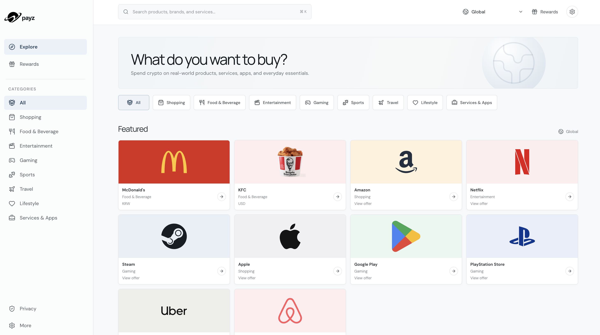

# payz

  

**Private payments for real-life 
everyday needs.**

Spend crypto on real-world products, services, apps, and everyday essentials without unnecessarily linking your purchases to public wallet activity.

[Website](https://payz.world) · [X](https://x.com/payzworld)

## Product principles

- No account required.
- No wallet connection required.
- No permanent purchase history in the customer experience.
- Separate payment processing from purchase fulfillment.

## Open-source ecosystem

Payz is organized into focused repositories, each with a distinct responsibility.

| Repository | Responsibility |
| --- | --- |
| [payz-app](https://github.com/payz-world/payz-app) | Public application and PWA for browsing products and completing purchases. |
| [payz-core](https://github.com/payz-world/payz-core) | Shared contracts, data schemas, validation, and core utilities. |
| [payz-payment-engine](https://github.com/payz-world/payz-payment-engine) | Payment selection, checkout orchestration, and purchase lifecycle. |
| [payz-privacy-router](https://github.com/payz-world/payz-privacy-router) | Payment route quotes, exchange creation, and status mapping. |
| [payz-contracts](https://github.com/payz-world/payz-contracts) | An Ethereum registry that records opaque nullifiers after purchase access is closed. Authorized submitter: [0x18f4…60c5](https://etherscan.io/address/0x18f4939f0e7b8a39faa0afdb205ceb21fa7060c5). |
| [payz-rewards](https://github.com/payz-world/payz-rewards) | Ethereum PAYZP points contract for capped issuance and redemption requests; distributor and fulfillment are not active. |
| [payz-settlement](https://github.com/payz-world/payz-settlement) | Settlement address configuration and Ethereum USDC transfer verification. |
| [payz-fulfillment](https://github.com/payz-world/payz-fulfillment) | Purchase fulfillment and delivery of redemption details. |
| [payz-catalog](https://github.com/payz-world/payz-catalog) | Product catalog, normalization, availability, and pricing. |
| [payz-sdk](https://github.com/payz-world/payz-sdk) | Client tools for integrating with the Payz API. |
| [payz-docs](https://github.com/payz-world/payz-docs) | Product documentation, privacy guidance, and API reference. |

See each repository for setup instructions, dependencies, and licensing information.

## Contributing

Start with the README in the relevant repository. Open an issue to discuss a bug or proposal, or submit a focused pull request.

Never include wallet keys, API credentials, or private purchase information in issues or pull requests.
